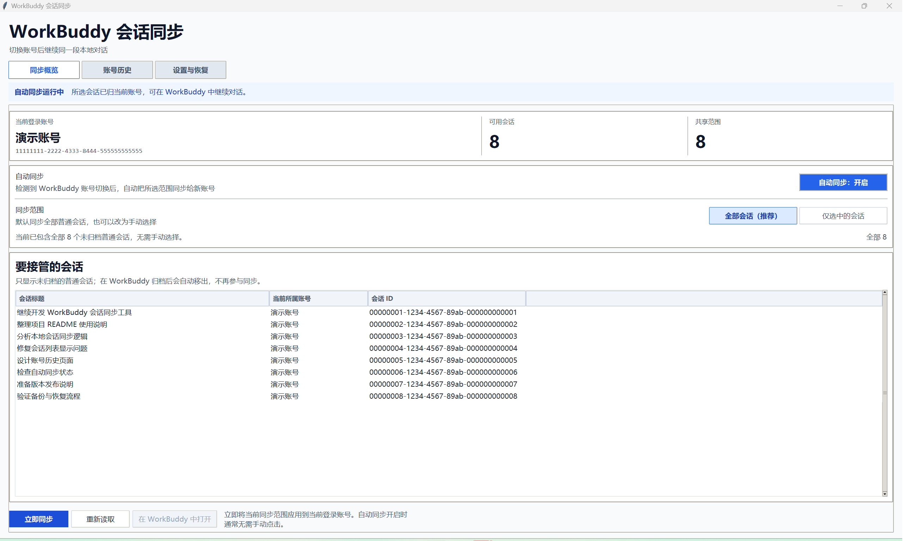

# WorkBuddy 会话同步


> 在 WorkBuddy 中切换账号后，继续使用这台电脑上原来的对话。

当正在使用的账号额度用完时，你仍然需要在 WorkBuddy 中手动登录另一个账号。本工具会检测账号变化，
把本机已有的普通对话交给新账号，让你从原来的会话继续，而不是重新开一个空白对话。



*同步概览：截图使用脱敏的演示账号和会话数据。*

## 为什么需要同步会话？

一个常见场景是：你正在用账号 1 完成一项工作，原来的对话里已经积累了需求、代码、文件和上下文；
但账号 1 的额度用完了，于是你在同一台电脑的 WorkBuddy 中登录账号 2，准备继续这项工作。

此时，账号 1 的对话并没有消失，消息文件和工作区仍在本机；只是 WorkBuddy 的侧栏通常只显示当前账号
所属的会话。因此你会遇到这些问题：

- 原来的对话还在电脑里，却无法从账号 2 的侧栏直接找到。
- 为了继续工作，只能手动复制上下文，或从空白对话重新开始。
- 多次切换账号后，很难确认本地对话现在归属哪个账号。

原因是 WorkBuddy 会在本地记录“这段对话属于哪个账号”。切换登录账号时，它不会自动把已有会话交给
新账号显示。

本工具正是为这个衔接设计的：检测到你登录新账号后，自动将设定范围内的普通会话归属切换到当前账号。
这样你在账号 2 中就能直接打开账号 1 正在进行的本地对话，接着工作，不需要搬运上下文或重新开聊。

它只处理**本机会话归属**：不复制聊天内容，不同步账号额度或登录信息，也不让多个账号同时登录。


本工具不会替你登录账号，也不会让多个账号同时在线。

## 主要功能

- **自动同步**：检测到 WorkBuddy 切换账号后，自动同步设定范围内的会话。
- **默认全选**：默认同步全部未归档普通会话，也可以只选择部分会话。
- **账号识别**：显示当前账号名称、完整账号 ID 和本机登录过的账号。
- **会话历史**：按账号查看当前归属的本地会话。
- **操作前备份**：修改数据库前自动创建备份，可以恢复该次操作涉及的会话归属。

## 快速开始

### 运行前准备

- Windows 11
- WorkBuddy AI 5.5.2
- [uv](https://docs.astral.sh/uv/)（首次启动时会通过 uv 准备 Python 依赖）

### 启动

1. 安装 [uv](https://docs.astral.sh/uv/getting-started/installation/)，安装完成后重新打开资源管理器。
2. 下载项目压缩包并解压，或使用 Git 克隆项目：

   ```powershell
   git clone 'https://github.com/xytss/workbuddy-session-sync.git'
   ```

3. 打开项目目录 `workbuddy-session-sync`。
4. 双击目录中的 **`启动GUI.bat`**。

启动脚本会在后台打开 GUI，黑色命令窗口不会持续停留。第一次启动需要等待 uv 准备运行环境。

### 日常使用

1. 在「同步概览」确认当前显示的账号名称和账号 ID 正确。
2. 保持默认的「自动同步：开启」和「全部会话（推荐）」。
3. 保持本工具运行，可以最小化窗口。
4. 回到 WorkBuddy，正常退出账号 1，然后登录账号 2。
5. 等待本工具提示“同步完成”。
6. 如果 WorkBuddy 侧栏没有立即刷新，在列表中高亮原来的对话，然后点击「在 WorkBuddy 中打开」。

以后再切换账号时，重复第 3～6 步即可。

## 同步哪些对话？

### 全部会话（推荐）

这是默认模式。切换账号后，本机所有未归档普通对话都会同步给当前账号，以后新建的对话也包括在内。

如果你的目标是“账号 1 用完就切账号 2，继续所有对话”，保持这个选项即可。

### 仅选中的会话

如果不想同步全部对话，可以选择这个模式：

- 点击每行最左侧的方框选择对话。
- 「全选列表」会选择列表里的全部对话。
- 「清空选择」会取消全部选择。
- 同步范围和勾选结果会自动保存，不需要再点击保存按钮。

### 哪些会话不会同步？

- 已归档的会话
- 已删除的会话
- WorkBuddy 后台自动化任务

在 WorkBuddy 中归档会话后，它会在工具下一次刷新时移出列表，不再参与同步。取消归档后会重新出现。

## 三个页面分别有什么用？

### 同步概览

日常主要使用这个页面。这里可以看到：

- 当前登录的账号名称和账号 ID。
- 本机有多少个可用对话。
- 当前准备同步多少个对话。
- 自动同步是否开启。
- 每个对话现在属于哪个账号。
- 每个对话的完整会话 ID；各列之间使用分隔线区分。

### 账号历史

这里会列出本机登录过的 WorkBuddy 账号，以及每个账号当前拥有的本地对话。

这不是一份永远不变的聊天备份。对话同步给新账号后，它会显示在新账号下面，不会同时在两个账号下面
生成副本。

### 设置与恢复

这里可以查看 WorkBuddy 数据位置、打开备份目录，或者在同步结果不符合预期时恢复之前的账号归属。

恢复前请完全退出 WorkBuddy，包括托盘和后台进程。

## 按钮是什么意思？

| 按钮 | 作用 | 是否修改数据 |
| --- | --- | --- |
| 立即同步 | 立即把当前同步范围应用给当前账号；通常只在需要手动触发时使用 | 是 |
| 重新读取 | 重新读取账号和会话列表 | 否 |
| 在 WorkBuddy 中打开 | 打开表格中高亮的一条会话；未选中时不可点击 | 否 |
| 恢复归属 | 从备份恢复某次同步涉及的账号归属 | 是 |
| 打开备份目录 | 打开本工具保存备份的位置 | 否 |

鼠标停留在「立即同步」「重新读取」或「在 WorkBuddy 中打开」按钮上时，会显示该按钮的详细说明。
在会话列表中高亮一条会话后，可以按 `Esc` 取消高亮。

自动同步开关、同步范围和会话勾选都会立即保存。顶部状态区会统一显示自动同步是否运行、是否正在等待
WorkBuddy，以及最近一次操作的结果。

## 常见问题

### 切换账号后，WorkBuddy 侧栏里还是没有旧对话

WorkBuddy 的侧栏有时不会立即刷新。回到本工具，在会话列表中选中目标对话，然后点击
「在 WorkBuddy 中打开」。通常不需要重启 WorkBuddy。

### 关闭本工具后还会自动同步吗？

不会。自动同步需要本工具保持运行，但可以最小化。

### 它会同步账号额度、记忆或登录信息吗？

不会。它只调整本机普通对话与当前账号的对应关系，不会同步：

- 账号额度和订阅状态
- 登录密码或 Token
- MCP 凭据
- WorkBuddy 记忆
- 远端资源授权

### 它会删除或重写聊天内容吗？

不会。同步前会自动备份数据库，工具不会删除对话，也不会改写保存完整消息的 JSONL 文件。

### 可以同时登录多个账号吗？

不可以。这个工具适用于“一次登录一个账号，然后在 WorkBuddy 中切换账号”的使用方式。

### 所有类型的对话都会同步吗？

不会。已归档、已删除的对话和后台自动化任务不会参与同步。

### 一定能保留全部上下文吗？

本工具可以保留本机会话 ID、消息文件和工作区引用，但 WorkBuddy 服务端是否接受跨账号继续使用
全部上下文，仍取决于 WorkBuddy 本身。重要对话建议先自行备份。

## 安全与隐私

- 账号名称和 ID 只从本机 WorkBuddy 登录文件读取。
- 不读取、保存或上传登录 Token。
- 每次真正修改数据库前都会创建备份。
- 备份保存在项目的 state/backups/，不会自动清理。
- state/、测试数据和本机工作文件不会提交到 Git 仓库。

## 当前支持范围

- Windows 11
- WorkBuddy AI 5.5.2 的本地数据格式
- 一台电脑、一个正在使用的 WorkBuddy 客户端
- Python 3.12 与 uv

如果 WorkBuddy 以后修改了数据库结构，本工具会停止操作并显示错误，不会尝试强行修改未知格式。

---

## 开发者信息

普通用户不需要阅读下面的内容。

<details>
<summary>展开命令行、数据位置、恢复与测试说明</summary>

### 命令行

~~~powershell
# 查看当前账号和本机会话，不修改数据库
uv run --locked workbuddy-sync diagnose

# 立即同步一次
uv run --locked workbuddy-sync sync

# 开启自动同步并持续运行
uv run --locked workbuddy-sync configure --auto-sync 'on' --scope 'all'
uv run --locked workbuddy-sync watch

# 关闭自动同步
uv run --locked workbuddy-sync configure --auto-sync 'off'
~~~

不要同时运行 GUI 和 watch。

### 数据位置

默认读取：

~~~text
WorkBuddy 数据库：%USERPROFILE%/.workbuddy-ai/workbuddy.db
登录信息：%LOCALAPPDATA%/CodeBuddyExtension/Data/Public/auth/workbuddy-desktop-ai.info
工具设置与备份：项目目录/state/
~~~

同步时只修改 sessions.user_id。每次修改前使用 SQLite Backup API 创建数据库备份，所有会话变更在
一个事务中完成。

### 恢复备份

建议在 GUI 的「设置与恢复」页面操作。也可以运行：

~~~powershell
uv run --locked workbuddy-sync restore 'state/backups/具体备份目录'
~~~

恢复只还原该次操作涉及的账号归属，不覆盖后来产生的新消息和新标题。

### 运行测试

~~~powershell
uv run --locked pytest -q
uv run --locked ruff check .
~~~

测试使用模拟数据库，不修改真实 WorkBuddy 数据。

</details>
